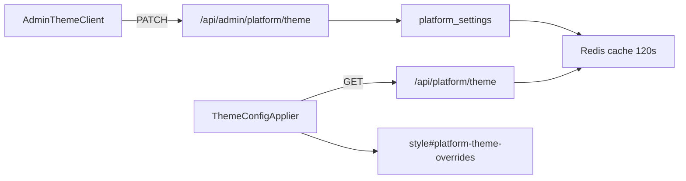

# Temas do Design System

Controle centralizado das cores da plataforma Orion Agency.

## Visão geral

| Camada | Onde |
|--------|------|
| **Defaults (código)** | `src/app/globals.css` — valores Orion (âmbar light / roxo dark) |
| **Overrides (runtime)** | `platform_settings` → chave `design_system_theme_config` |
| **Admin UI** | `/admin/platform/theme` — abas Claro / Escuro |
| **Aplicação no app** | `ThemeConfigApplier` injeta `<style id="platform-theme-overrides">` |

O toggle claro/escuro do usuário (`localStorage` `ai-traffic-theme`) continua funcionando; o admin define **quais cores** cada modo usa.

## Tokens editáveis

Cada tema (light/dark) expõe 14 tokens agrupados em:

### Superfícies e texto
- `--surface-bg`, `--surface-card`
- `--text-main`, `--text-dim`, `--text-dimmer`
- `--border-color` (hex ou `rgba(...)`)

### Accent e CTA
- `--ui-accent` — accent temático (filtros, stepper, links)
- `--ui-accent-muted`, `--ui-accent-border`
- `--ui-accent-btn-from`, `--ui-accent-btn-to`, `--ui-accent-btn-text` — botões `.ui-btn-accent`

### Marca
- `--amber-bright` (marca primária / âmbar)
- `--violet-bright` (IA / Agency Brain)

## Padrão Orion

| Modo | Accent | CTA |
|------|--------|-----|
| **Light** | Âmbar `#f5a623` | Gradiente âmbar, texto escuro |
| **Dark** | Roxo `#7c3aed` | Gradiente violeta, texto branco |

A sidebar **permanece escura** (`--sidebar-bg`) — não é controlada por esta tela.

## API

| Endpoint | Auth | Uso |
|----------|------|-----|
| `GET /api/platform/theme` | Público | App carrega overrides (cache 60s) |
| `GET /api/admin/platform/theme` | Billing admin | Admin lê config atual |
| `PATCH /api/admin/platform/theme` | Billing admin | Salva `{ light, dark }` ou `{ reset: true }` |

## Código

```
src/lib/design-system/theme-config.ts   — tipos, defaults, CSS builder
src/lib/design-system/theme-settings.ts — persistência (platform_settings + Redis)
src/components/theme/ThemeConfigApplier.tsx
src/components/admin/AdminThemeClient.tsx
```

## Boas práticas

1. **Use tokens, não hex solto** — componentes devem referenciar `var(--ui-accent)`, não `#f5a623`.
2. **Teste os dois modos** — salve e alterne claro/escuro na sidebar antes de publicar.
3. **Valores rgba** — bordas e muted accent aceitam `rgba(...)`; o color picker só funciona em hex.
4. **Restaurar padrão** — botão "Restaurar padrão Orion" grava os defaults do código.

## Fluxo de dados



## Referência completa

Ver também [design-system.md](../design-system.md) para classes `ui-*`, componentes `Ds*` e anti-patterns.
