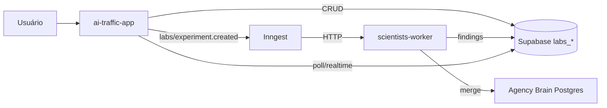

# Arquitetura

## Stack

```txt
ai-traffic-app (Vercel)       → UI, APIs leves, Inngest functions
scientists-worker (Cloud Run) → Scientists, jobs pesados, scraping
Supabase                      → persistência labs_*
Inngest                       → orquestração, retries, cron
Gemini 2.5 Flash              → texto, análise, hipóteses
Fal.ai + Flux Pro             → imagens (futuro)
```

## Dois repositórios

| Repo | Path local | Responsabilidade |
|------|------------|------------------|
| **ai-traffic-app** | `C:\Users\Tiago Carvalho\Documents\projetos\ai-traffic-app` | Next.js, `/api/labs/*`, Inngest webhook, UI Labs |
| **scientists-worker** | `C:\Users\Tiago Carvalho\Documents\projetos\scientists-worker` | Módulos Scientist, `/internal/labs/*`, nightly handlers |

**Regra:** Vercel **nunca** executa pesquisa longa, scraping pesado ou jobs noturnos.

## Diagrama



## Banco dual

| Sistema | Uso |
|---------|-----|
| **Supabase** | Experimentos Labs, runs, findings, memórias Labs, créditos Labs |
| **Postgres (TypeORM)** | Agency Brain existente: `client_hypotheses`, `client_learnings`, etc. |

Merge final via job `agency.brain.merge` — evita big-bang migration.

## Comunicação Inngest → Worker

```txt
POST /internal/labs/run-scientist
  { experimentId, scientistId, input }

POST /internal/labs/run-experiment-step
  { experimentId, step }

POST /internal/labs/nightly-job
  { jobId, payload }
```

Auth: API key (`SCIENTISTS_WORKER_API_KEY`), rate limit, apenas chamadas de Inngest/Vercel interno.

## Estrutura de pastas

### ai-traffic-app

```txt
src/app/api/labs/           # CRUD experimentos
src/app/api/inngest/        # webhook + functions
src/components/labs/        # UI
src/lib/labs/               # client Supabase, tipos espelhados
docs/labs/                  # esta documentação
```

### scientists-worker

```txt
src/scientists/             # um módulo por Scientist
src/registry.ts
src/orchestrator/
src/routes/internal/
src/db/                     # Supabase client
Dockerfile
cloudbuild.yaml
```

## Interface Scientist

Implementação canônica no **worker**; tipos espelhados no app:

```ts
interface Scientist {
  id: string;
  name: string;
  tier: ScientistTier;
  category: ScientistCategory;
  estimatedCredits: number;
  estimatedDurationSeconds: number;
  requiredInputs: string[];
  canRun(input: ScientistInput): boolean;
  run(input: ScientistInput): Promise<ScientistResult>;
}
```

Registry central: `getScientist(id)`, `listScientists()`.

Persistência única: `saveScientistResult(experimentId, result)` → `labs_agent_runs`, `labs_findings`, `labs_sources`, `labs_credits_usage`.

## Tipos compartilhados (MVP)

| Opção | Descrição |
|-------|-----------|
| **A (MVP)** | Copiar schemas Zod/TS manualmente; checklist no PR |
| **B (futuro)** | Pacote npm `@traffic-ai/labs-core` |
| **C (futuro)** | Git submodule / pnpm workspace |

## Scientist ≠ microserviço

Um Cloud Run service `traffic-ai-scientists-worker` com módulos internos.

Separar worker adicional só quando: Python, browser farm, visão pesada, Monte Carlo, GraphRAG, timeouts recorrentes.

## Dados tempo real vs assíncronos

| Tempo real (API direta) | Assíncrono (Inngest) |
|-------------------------|----------------------|
| Dashboard, CPA, ROAS, CTR | Labs experiments |
| Métricas de campanha | Jobs noturnos |
| Decisões operacionais do dia | Análise de imagens, relatórios pesados |
